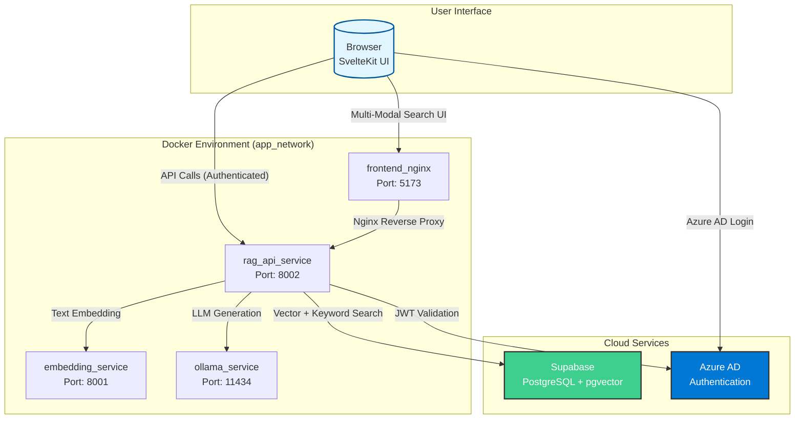

# Knowledge Base Search & RAG API

This project implements a sophisticated, multi-service application for building and querying a knowledge base using advanced AI search capabilities and the Retrieval-Augmented Generation (RAG) pattern. It features separate services for document embedding, an advanced RAG API with multiple search modes, and a modern SvelteKit-based web interface optimized for Australian legal document search.

## 🚀 Key Features

### Advanced Search Capabilities
- **Semantic Search**: AI-powered semantic understanding using state-of-the-art embeddings
- **Keyword Search**: Traditional full-text search with fuzzy matching support
- **Hybrid Search**: Intelligent combination of semantic and keyword approaches using Reciprocal Rank Fusion (RRF)
- **Configurable Search**: Adjustable weights, similarity thresholds, and search parameters

### RAG-Powered Question Answering
- **Context-Aware Responses**: Generate intelligent answers using retrieved document context
- **Source Attribution**: Every answer includes relevant source documents with metadata
- **Australian Legal Focus**: Specialized prompting for Australian legal context and relevance

### Modern Web Interface
- **Multi-Modal Search Interface**: Toggle between vector, keyword, and hybrid search modes
- **Advanced Search Controls**: Fine-tune search parameters with intuitive UI controls
- **Document Preview**: In-browser PDF preview with secure authentication
- **Activity Logging**: Track user interactions and search patterns

### Enterprise-Ready Features
- **Microsoft Azure AD Integration**: Secure authentication with MSAL
- **Microservice Architecture**: Independent, scalable services
- **Production Deployment**: Docker-based deployment with environment management
- **Secret Management**: Doppler integration for secure configuration

## Architecture Overview

The application is designed as a set of containerized microservices orchestrated by Docker Compose. This architecture separates concerns, allowing for independent development, scaling, and maintenance of each component.



## 🔍 Search Modes Explained

### Vector Search (Semantic)
- **Technology**: BAAI/bge-large-en-v1.5 embeddings (1024 dimensions)
- **Best For**: Conceptual queries, meaning-based search, cross-lingual understanding
- **Example**: "contract termination procedures" → finds documents about ending agreements

### Keyword Search (Lexical)
- **Technology**: PostgreSQL full-text search with ranking
- **Best For**: Exact term matching, specific terminology, known phrases
- **Features**: Fuzzy matching, similarity thresholds, stemming support
- **Example**: "section 23(a)" → finds exact legal references

### Hybrid Search (Combined)
- **Technology**: Reciprocal Rank Fusion (RRF) algorithm
- **Configuration**: Adjustable vector/keyword weights (default 70%/30%)
- **Best For**: Comprehensive search results combining both approaches
- **Benefits**: Balances semantic understanding with exact term matching

## Technology Stack

- **Backend**: Python, FastAPI, LangChain, Supabase (PostgreSQL + pgvector)
- **Frontend**: SvelteKit, TypeScript, Tailwind CSS, Nginx
- **AI/ML**: Sentence Transformers, Ollama (local LLM), OpenAI (optional)
- **Authentication**: Microsoft Azure AD (MSAL)
- **Infrastructure**: Docker, Docker Compose, Doppler (secrets)
- **Search**: Vector similarity, PostgreSQL FTS, Hybrid RRF

## Project Structure

```
kb_search_api/
├── embedding_service/          # AI embedding generation service
│   ├── main.py                # FastAPI app with sentence transformers
│   ├── Dockerfile             # Production-ready container
│   └── requirements.txt       # Python dependencies
├── rag_api_service/           # Advanced search and RAG API
│   ├── main.py               # Multi-modal search endpoints
│   ├── security.py           # Azure AD JWT validation
│   ├── Dockerfile            # Production container
│   └── requirements.txt      # Python dependencies
├── search_ui/                # Modern SvelteKit web interface
│   ├── src/lib/              # Search components and auth logic
│   ├── nginx.conf            # Production reverse proxy config
│   ├── Dockerfile            # Multi-stage production build
│   └── package.json          # Node.js dependencies
├── documentation/            # Comprehensive project documentation
├── docker-compose.yml        # Development orchestration
├── docker-compose.prd-with-models.yml  # Production with model preservation
├── doppler.prd.yaml         # Production environment config
├── deployment_guide.md      # Production deployment guide
└── ENVIRONMENT_SETUP.md     # Environment management guide
```

## Prerequisites

- **Docker** & **Docker Compose** (or Docker Desktop)
- **Doppler CLI** (recommended) or manual environment configuration
- **Azure AD Application** registration for authentication
- **Supabase Project** with PostgreSQL and pgvector extension

## Getting Started

### 1. Clone the Repository

```bash
git clone https://github.com/aandreyev/kb_search_api.git
cd kb_search_api
```

### 2. Environment Configuration

**Option A: Using Doppler (Recommended)**
```bash
# Install Doppler CLI
curl -Ls https://cli.doppler.com/install.sh | sh

# Configure for development
doppler setup --config-file doppler.dev.yaml

# Set your secrets in Doppler dashboard
doppler secrets set SUPABASE_URL="your-supabase-url"
# ... set other required secrets
```

**Option B: Manual .env Configuration**
```bash
# Copy environment template
cp doppler.dev.yaml .env
# Edit .env with your actual values
```

### 3. Launch the Application

**Quick Start (Development)**
```bash
# Using Doppler
doppler run -- docker compose up --build

# Using .env file
docker compose up --build
```

**Production Deployment**
```bash
# See deployment_guide.md for comprehensive production setup
doppler setup --config-file doppler.prd.yaml
doppler run -- docker compose -f docker-compose.yml -f docker-compose.prd-with-models.yml up -d --build
```

### 4. Access the Application

- **Web Interface**: http://localhost:5173 (requires Azure AD login)
- **API Documentation**: http://localhost:8002/docs (interactive API docs)
- **Health Check**: http://localhost:8002/health

## 🔧 API Endpoints

### Search API
```bash
POST /search
Content-Type: application/json
Authorization: Bearer <azure-ad-token>

{
  "query": "contract termination procedures",
  "mode": "hybrid",           // "vector", "keyword", or "hybrid"
  "vector_weight": 0.7,       // Weight for semantic search (hybrid mode)
  "keyword_weight": 0.3,      // Weight for keyword search (hybrid mode)
  "limit": 10,                // Number of results to return
  "fuzzy": true,              // Enable fuzzy keyword matching
  "similarity_threshold": 0.3, // Minimum similarity for fuzzy matches
  "min_score": 0.1            // Minimum relevance score threshold
}
```

### RAG Chat API
```bash
POST /chat
Content-Type: application/json
Authorization: Bearer <azure-ad-token>

{
  "query": "What are the requirements for contract termination in Australia?",
  "limit": 5  // Number of source documents to retrieve
}
```

### Additional Endpoints
- `GET /preview-pdf?url=<supabase-url>` - Secure PDF preview
- `POST /log-activity` - User activity logging
- `GET /health` - Service health status

## 🎯 Use Cases

### Legal Research
- **Semantic Queries**: "What are the obligations of landlords in residential tenancies?"
- **Exact References**: "section 142 Residential Tenancies Act"
- **Hybrid Approach**: "breach of contract remedies" (finds both conceptual and exact matches)

### Document Discovery
- **Content-Based**: Find documents by meaning, not just keywords
- **Metadata Search**: Filter by document type, author, law area, date
- **Contextual Preview**: Preview relevant sections before full document access

### Question Answering
- **Research Assistant**: Get AI-generated answers with source attribution
- **Australian Focus**: Responses prioritize Australian legal context
- **Source Verification**: Every answer includes clickable source documents

## 📊 Performance & Scaling

### Model Performance
- **Embedding Model**: BAAI/bge-large-en-v1.5 (state-of-the-art semantic understanding)
- **Response Time**: Sub-second search responses with caching
- **Throughput**: Optimized for concurrent users with connection pooling

### Deployment Options
- **Development**: Single-machine Docker Compose setup
- **Production**: Scalable microservice deployment with model preservation
- **Cloud**: Compatible with major cloud providers (tested on Digital Ocean)

## 🔒 Security & Authentication

### Authentication Flow
1. **Frontend**: MSAL.js acquires Azure AD tokens with specific scopes
2. **Backend**: JWT validation with JWKS key rotation support  
3. **API Access**: All endpoints require valid Azure AD bearer tokens
4. **Activity Logging**: All user actions are logged with user context

### Security Features
- **Token Validation**: Comprehensive JWT verification (signature, issuer, audience)
- **CORS Protection**: Configured for specific origins only
- **Rate Limiting**: Built-in FastAPI rate limiting capabilities
- **Secure Headers**: Production nginx configuration with security headers

## 📚 Documentation

- **[deployment_guide.md](deployment_guide.md)** - Production deployment with model preservation
- **[ENVIRONMENT_SETUP.md](ENVIRONMENT_SETUP.md)** - Environment management and configuration
- **[documentation/ai_architecture_summary.md](documentation/ai_architecture_summary.md)** - AI components and architecture
- **[STARTUP_SCRIPTS.md](STARTUP_SCRIPTS.md)** - Development and deployment scripts

## 🚀 Recent Updates

### Advanced Search System
- **Multi-Modal Search**: Vector, keyword, and hybrid search capabilities
- **RRF Algorithm**: Sophisticated result fusion for hybrid search
- **Configurable Parameters**: Fine-tuned search controls in UI and API

### Production Readiness
- **Environment Separation**: Distinct dev/production configurations
- **Model Preservation**: Zero-downtime deployments with model reuse
- **Health Monitoring**: Comprehensive health checks and logging

### Enhanced User Experience
- **Modern UI**: Intuitive search interface with advanced controls
- **Real-time Feedback**: Live search parameter adjustment
- **Document Preview**: Secure in-browser document viewing

## 🔮 Future Enhancements

- **Conversation Memory**: Multi-turn chat with context retention
- **Advanced Reranking**: ML-based result reranking for improved relevance
- **Multi-Language Support**: Extend beyond English legal documents
- **Query Expansion**: Automatic query enhancement for better results
- **Analytics Dashboard**: Search analytics and usage insights

## ⚡ Quick Commands

```bash
# Development
doppler run -- docker compose up          # Start all services
doppler run -- docker compose logs -f     # View logs
docker compose down                        # Stop services

# Production Deployment  
doppler setup --config-file doppler.prd.yaml
doppler run -- docker compose -f docker-compose.yml -f docker-compose.prd-with-models.yml up -d --build

# Health Checks
curl http://localhost:8002/health         # Check API health
curl http://localhost:8001/health         # Check embedding service
curl http://localhost:5173                # Check frontend
```

## 📝 License & Support

This project is designed for Australian legal document search and retrieval. For deployment support, see the comprehensive guides in the documentation folder.

Built with ❤️ for intelligent legal research and document discovery. 